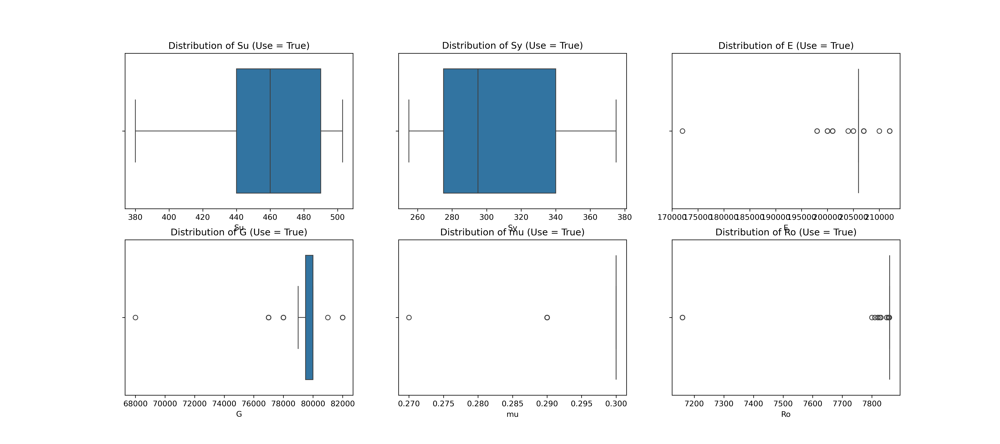

# ML-for-Material-Selection

This project applies machine learning to assist in selecting materials suitable for electric vehicle (EV) chassis design, based on their mechanical properties.

## 📊 Dataset Description

Each material entry includes:

- `Material`: Material name (and heat treatment if applicable)
- `Su`: Ultimate Tensile Strength (MPa)
- `Sy`: Yield Strength (MPa)
- `E`: Elastic Modulus (MPa)
- `G`: Shear Modulus (MPa)
- `mu`: Poisson’s Ratio
- `Ro`: Density (kg/m³)
- `Use`: Boolean label indicating if the material is suitable for EV chassis

Materials labeled as `Use = True` typically fall in the category of low- to medium-carbon steels, which offer a good balance of strength, ductility, and manufacturability for chassis structures.




---

## 🤖 Model

A **Random Forest Classifier** was trained to predict material suitability (`Use`) based on the mechanical properties listed above.

### ✅ Performance

- **Accuracy**: 99.36%  
- **F1 Score**: 96.43%

### 🔍 Feature Importance

The model relies most heavily on yield strength (`Sy`), tensile strength (`Su`), and elastic modulus (`E`), as shown below:


### 🌳 Decision Logic

One of the trees in the forest was visualized to better understand how decisions are made. The tree splits based on mechanical thresholds like `Sy`, `Su`, and `E`.


---

## 🛠️ Material Recommendation Function

The function `material_recommend_for_selection()` allows users to input a set of mechanical properties and returns a list of candidate materials within ±5% tolerance of each value.

```python
def material_recommend_for_selection(input_values, tolerance=0.05):
    inp = pd.DataFrame([input_values])
    out = model.predict(inp)

    if out[0] == 0:
        return "No material suitable for selection"
    else:
        filtered_df = df[
            (df['Su'].between(input_values['Su'] * (1 - tolerance), input_values['Su'] * (1 + tolerance))) &
            (df['Sy'].between(input_values['Sy'] * (1 - tolerance), input_values['Sy'] * (1 + tolerance))) &
            (df['E'].between(input_values['E'] * (1 - tolerance), input_values['E'] * (1 + tolerance))) 
        ]
        m = list(filtered_df[filtered_df['Use'] == True]['Material'].unique())
        return f"Materials suitable for selection: {m if m else 'None found'}"
```

🔎 Example Usage
```
mech_prop = {
    'Su': 440,
    'Sy': 275,
    'E': 206000
}

material_recommend_for_selection(mech_prop)
```
Output:

```

Materials suitable for selection: [
  'ANSI Steel SAE 1117 annealed',
  'ANSI Steel SAE 1118 annealed',
  'ISO EN 16Mo3',
  'DIN DIN St44.0',
  'DIN DIN Ck10 case-hardened',
  'DIN DIN 15Mo3',
  'DIN DIN X6Cr17',
  'BS BS CFS6NBK',
  'CSN CSN 11448',
  'CSN CSN 11453',
  'CSN CSN 13030',
  'CSN CSN 15020',
  'CSN CSN 16329',
  'CSN CSN 17040 normalized',
  'CSN CSN 17125 normalized',
  'GOST Steel 25 GOST 1050-88 normalized',
  'GOST Steel 20G GOST 1050-88 normalized',
  'NF NF XC18',
  'NF NF 15D3'
]
```
